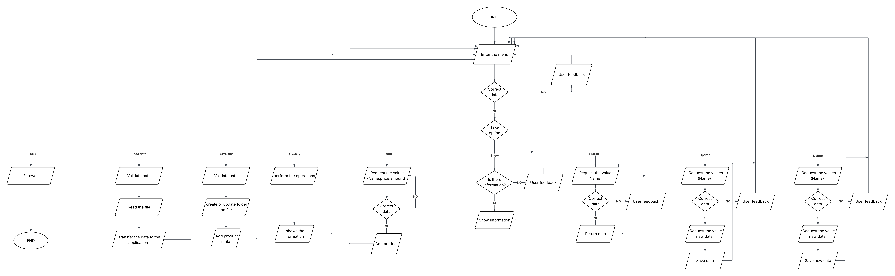

# Sistema de Gestión de Inventario en Python 📦

Este proyecto consiste en un sistema de gestión de inventario desarrollado en **Python**, diseñado para administrar productos mediante operaciones **CRUD**, cálculo de estadísticas y **persistencia en archivos CSV**.

El objetivo principal es aplicar buenas prácticas de programación en Python, incluyendo el uso de:

* **listas**
* **diccionarios**
* **funciones**
* **modularización**
* **manejo de archivos**
* **validación de datos**
* **manejo de errores**
* **experiencia de usuario en consola (CLI)**

Este repositorio forma parte de una actividad académica enfocada en fortalecer la lógica de programación y el desarrollo estructurado de software.

---

## 📖 Descripción del programa

El sistema permite gestionar un inventario mediante un menú interactivo en consola.

Cada producto se almacena con la siguiente información:

* Nombre del producto
* Precio
* Cantidad disponible

Además, el sistema permite:

* Agregar productos
* Mostrar inventario
* Buscar productos
* Actualizar productos
* Eliminar productos
* Calcular estadísticas
* Guardar inventario en CSV
* Cargar inventario desde CSV

---

## 🗺️ Diagrama de Flujo

El siguiente diagrama representa el flujo general del sistema.

<p align="center">
  
</p>

---

## ⚙️ Funcionalidades actuales

Actualmente el sistema permite:

* Registrar productos
* Validar entradas del usuario
* Buscar productos por nombre
* Actualizar información de productos
* Eliminar productos
* Mostrar inventario en formato tabular
* Calcular estadísticas del negocio
* Guardar información en CSV
* Cargar inventario desde CSV
* Fusionar o sobrescribir inventario
* Manejo de errores sin cerrar la aplicación
* Interfaz de consola mejorada con colores y limpieza de terminal

---

## 📊 Estadísticas implementadas

El sistema calcula automáticamente:

* **Tipos registrados**
* **Total de unidades**
* **Valor total del inventario**
* **Producto más caro**
* **Producto con mayor stock**

Ejemplo:

```text
===== ESTADÍSTICAS =====

Tipos registrados      : 3
Total unidades         : 25
Valor total            : $150000.00
Producto más caro      : Monitor ($80000.00)
Mayor stock            : Mouse (10 unidades)
```

---

## 🧠 Estructura de datos utilizada

Cada producto se almacena con la siguiente estructura:

```python
producto = {
    "nombre": nombre,
    "precio": precio,
    "cantidad": cantidad
}
```

Todos los productos se almacenan dentro de:

```python
inventario = []
```

---

## 💻 Ejemplo de ejecución

```text
=============================================
        SISTEMA DE GESTIÓN DE INVENTARIO
=============================================

1. Agregar producto
2. Mostrar inventario
3. Buscar producto
4. Actualizar producto
5. Eliminar producto
6. Calcular estadísticas
7. Guardar inventario CSV
8. Cargar inventario CSV
9. Salir
```

Ejemplo de inventario:

```text
===== INVENTARIO =====

Nombre              Precio         Cantidad       Subtotal
-----------------------------------------------------------------
Laptop              $2500.00       2              $5000.00
Mouse               $80.00         5              $400.00
```

---

## 📋 Requisitos

Para ejecutar el proyecto es necesario tener instalado:

* **Python 3.10 o superior**

Puedes verificar la instalación con el siguiente comando:

```bash
python --version
```

---

## 🚀 Cómo ejecutar el programa

### 1. Clonar el repositorio

```bash
git clone https://github.com/JAHN77/inventario_riwi.git
```

---

### 2. Entrar en la carpeta del proyecto

```bash
cd inventario_riwi
```

---

### 3. Ejecutar el programa

Desde la carpeta `src`:

```bash
python src/app.py
```

---

## 📁 Estructura del proyecto

```text
inventario_riwi/
│
├── src/
│   ├── app.py
│   ├── servicios.py
│   └── archivos.py
│
├── data/
│   └── inventario.csv
│
├── docs/
│   └── diagrama_flujo_inventario.png
│
├── README.md
└── .gitignore
```

---

## 🗂️ Descripción de módulos

### `app.py`

Archivo principal del sistema.

Contiene:

* menú interactivo
* presentación visual
* colores
* limpieza de terminal
* control del flujo principal

---

### `servicios.py`

Contiene toda la lógica de negocio:

* validaciones
* operaciones CRUD
* búsqueda
* estadísticas
* visualización del inventario

---

### `archivos.py`

Módulo encargado de la persistencia de datos:

* guardar CSV
* cargar CSV
* validación de archivos
* manejo de errores

---

## 📈 Mejoras futuras

Próximas mejoras planeadas:

* exportación a JSON
* reportes avanzados
* filtros por rango de precio
* ordenamiento por stock
* interfaz gráfica (Flet / Tkinter)
* conexión a base de datos
* pruebas unitarias con `pytest`

---

## 👨‍💻 Autor

**Juan Andres Henriquez**  
**Riwi - Clan Cortissoz**